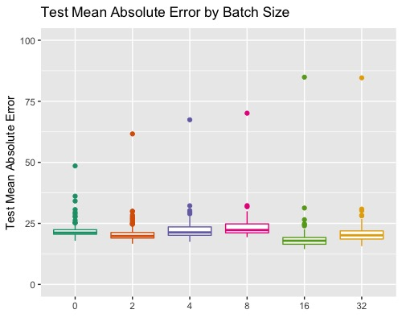
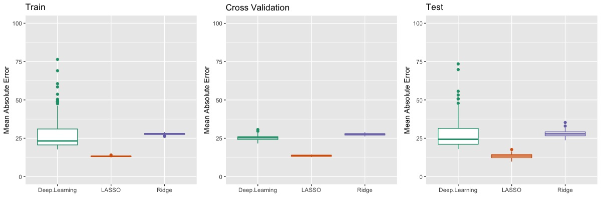
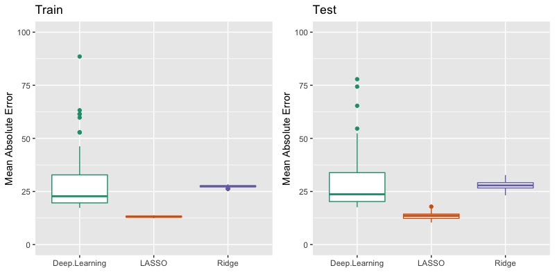
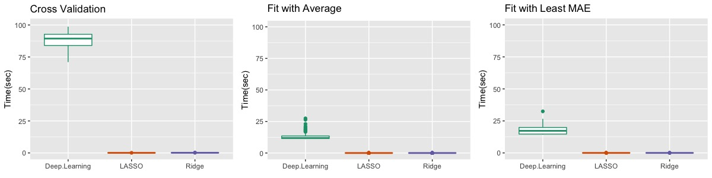

# Bitcoin Prediction Model Performance Comparison
- Soonmo Seong
- March 29th, 2020

## Bitcoin Price History Data

This [bitcoin daily history data](https://drive.google.com/file/d/1WdAlHmxsBfsYRWyFZvuKE0tAPFulLhNe/view?usp=sharing) 
comes from [Yahoo finance](https://finance.yahoo.com/quote/BTC-USD/history?p=BTC-USD). 
The size of this data is 2011 from September 17th, 2014 to March 19th, 2020. 

## Bitcoin Price Time-Series dataset

The time-series dataset that we will use is made of the bitcoin data at opening. 
Time-series data generator is [here](https://drive.google.com/file/d/1BBCtDl6BCtFQOdTKOBwFx-oey8xl8l_R/view?usp=sharing).

The size of this time-series dataset is 1,000 with 65 variables. 
This means that one observation has a certain day's bitcoin price as a response 
and past 64 days' bitcoin price as predictors.
The data size is randomly selected. 

80 percentage of the data size is assigned to train data and rest of it is assigned 
to test data.

## Models

Feed forward neural nets, LASSO regression, and Ridge regression are compared 
in terms of predictive performances, mean absolute error on test data. 
The mean absolute error is  the average of absolute values of difference 
between bitcoin prices and predicted bitcoin prices.

In order to save time and prevent the neural nets from being overfitted, 
early stopping is applied with patience = 5. patience = 5 means it will stop 
fitting the neural nets without improvement of performance in 5 epochs. 
Just for the record, early stopping saves a lot of time and performance on test data.

## Architectures of Neural nets, LASSO, and Ridge

### Feed forward neural nets

1. Layer - It have four layers. These are composed of one input layer, two hidden layers, one output layer as below. The output layer has no activation for regression analysis.

```R
        build_DL_model = function() {
            model = keras_model_sequential() %>%
                layer_dense(units = 64, activation = "relu",
                    input_shape = dim(train_data)[[2]]) %>%
                layer_dense(units = 128, activation = "relu") %>%
                layer_dense(units = 64, activation = "relu") %>%
                layer_dense(units = 1)
            model %>% compile(
                optimizer = "rmsprop",
                loss = "mse",
                metrics = c("mae")
                ) 
            }
```

2. Loss function -  mean square error
3. Optimizer - rmsprop, one of the famous variants of stochastic gradient descent which uses different learning rates by units.
4. Batch size - it will be decided out of 1, 2, 4, 8, 16, 32.
5. Number of epochs - the optimal number of epochs will be decided between 0 to 500.

### LASSO and Ridge regression

1. Lambda - it will be decided by cross-validation

## Experiment on Batch Size



6 batch sizes are compared in terms of performance on test data. 
Figure 1 shows box plots of the test mean absolute error by batch size. 
There is no difference between batch sizes. Just 4 is selected 
as the batch size. Code is [here](https://drive.google.com/file/d/1QkNT0VjL8Vz8s1lwDp56dhjdlf77-IVg/view?usp=sharing)


## Performance Comparison

In order to tune the number of epochs and lambda, 5-fold cross validation 
is applied. Cross-validation is iterated 30 times. Fitting those models on 
train and test data is iterated 100 times. When fitting the model, 
the optimal number of epochs and optimal lambda are computed in two ways, 
taking average and the least mean absolute error. Code is [here](https://drive.google.com/file/d/1WQr3JUjuuYicD-e8n3_hTxOBoKHQKHfY/view?usp=sharing).
1. Average of the number of epochs and lambda

   
    
    Given 30 iterations of cross-validation, the average of the number of epochs is
   used for fitting the neural nets. Likely, the average of lambdas is also used for 
   lasso and ridge regression respectively. The number of epochs is 17, lambda 
   for LASSO is 2.83, and lambda for Ridge is 43.06.
    
2. The number of epochs and lambda at the least mean absolute error
   
    
   
    Out of 30 iterations, the number of epochs and lambda are chosen as optimal 
    parameters when the mean absolute error is least. The number of epochs is 15, 
    lambda for LASSO is 2.82, and lambda for Ridge is 41.30. Using parameters that
    give the least mean absolute error of 30 iterated cross-validation shows 
    more variability than using the average of parameters that give the mean absolute
    errors.

3. Time
   
    
   
    The neural nets take much more time than LASSO and Ridge regarding 
    cross-validation and fitting. Before using early stopping for the neural nets, 
    it takes more than 10 minutes per one cross-validation and it causes 
    over-fitting.

## Conclusion

For predicting the daily open price of bitcoin, LASSO regression is the best 
in terms of mean absolute error and time. However, all the three models are 
quite good to predict the price of bitcoin because the bitcoin price is over 
6,000 dollar and the mean absolute error is around 25 dollars at average. 
In addition, they are not over-fitted.

The neural nets show the most variability on accuracy, which is 
the mean absolute error, and spend the most time.

Interestingly, using the average of the number of epochs and lambda 
reduces the variability of accuracy and spent time compared to using 
the number of epochs and lambda at the least mean absolute error 
from 30-times iterated cross-validation.