# Bitcoin Prediction Model Performance Comparison
- Soonmo Seong
- March 29th, 2020

This analysis is done under Professor Kamiar's supervising and teaching(Baruch College, CUNY). Thanks Professor!

## Bitcoin Price History Data

This [bitcoin daily history data](https://drive.google.com/file/d/1WdAlHmxsBfsYRWyFZvuKE0tAPFulLhNe/view?usp=sharing) 
comes from [Yahoo finance](https://finance.yahoo.com/quote/BTC-USD/history?p=BTC-USD). 
The size of this data is 2011 from September 17th, 2014 to March 19th, 2020. 

## Bitcoin Price Time-Series dataset

The time-series dataset that we will use is made of the bitcoin data at opening. The size of this time-series dataset is  1,980 with 31 variables including one response. This means that one observation has a certain day's bitcoin price as a response and past 30 days' bitcoin price as predictors.

80 percentage of the data size is assigned to train data and rest of it is assigned to test data.

## Models

Feed forward Deep Learning, LASSO regression, Ridge regression, and Elastic net regression are compared in terms of predictive performances, mean absolute error on test data. The mean absolute error is the average of absolute values of difference between bitcoin prices(y) and predicted bitcoin prices(y_hat).

## Preventing Deep Learning From Overfitting

In order to save time and prevent the Deep Learning(DL) from being overfitted, there are five common ways to go: larger data size, small capacity, dropout, regularization, and early stopping. These five methods prevent overfitting and improve fest performance. Below intuitive explanation comes from \href{https://keras.rstudio.com/articles/tutorial_overfit_underfit.html}{Keras Tutorial: Overfitting and Underfitting} and Deep Learning by Yoshua Bengio.

### Increasing the data size
    
It's not easy to increase the data size in real-life situations. However, fake observations can increase the data size and improve the performance of models. For example, suppose we build a model that classifies hand-written digits from zero to nine. Fake observations can be made by transforming some observations in the data such as tilted images of number three.
    
### Small capacity
    
In general, as the number of nodes in a layer decreases, the layer tends not to be overfitted.

### Dropout
    
Dropout is a simple and powerful tool that prevents overfitting when DL has wides layers, each of which has a lot of nodes, because it randomly drops some nodes when it's trained. The dropout rate of 0.2 to 0.5 is recommended.
    
[This paper](https://uksim.info/isms2016/CD/data/0665a174.pdf) explains the relationship between dropout and L2 regularization. Simply, dropout performs better with wider layers than L2 regularization does. When dropout is applied to this DL model, the performance gets worse.
    
### Regularization
    
DL has three regularization methods such as L1, L2, and elastic net. Each has $l$ that controls the magnitude of regularization as same as statistical machine learning literature. However, the difference is that DL can regularize weight, bias, and output of layers.

y = Wx + b
#### Kernel regularizer - reducing W.

#### Bias regularizer - reducing b.

#### Activity regularizer - reducing y, implying that this regularizer decreases both W and b.
        
### Early stopping
    
Early stopping only controls the number of epoch to feed. Given the condition of early stopping, DL stops to feed the entire dataset if there is no improvement on accuracy such as mean absolute error. Early stopping have two main  arguments such as patience and min-delta. early stopping is applied with patience = 5. patience = 5 means it will stop fitting the neural nets without improvement of performance in 5 epochs. min-delta is the minimum improvement that is considered as no improvement. Just for the record, early stopping saves a lot of time to optimize the architecture of DL and other hyperparameters such as batch size and dropout rate.

## Architectures of Deep Learning

### Activation function

rectified linear unit, one of the best activation functions as default.

### Loss function

mean square error

### Optimizer

rmsprop, one of the famous variants of stochastic gradient descent which uses different learning rates by units.


### Layer

It has five layers which are composed of one input layer, three hidden layers, one output layer as below. The output layer has no activation for regression analysis. Cross-validation is used to optimize the structure of three hidden layers below.

```R
build_DL_model = function() {
        model = keras_model_sequential() %>%
                 layer_dense(units = p, activation = "relu", 
                 input_shape = dim(X.train)[[2]]) %>%
                  layer_dense(units = 16, activation = "relu") %>%
                  layer_dense(units = 16, activation = "relu") %>%
									layer_dense(units = 22, activation = "relu") %>%
             	 layer_dense(units = 1)
  		model %>% compile(
    							optimizer = "rmsprop", loss = "mse", metrics = c("mae") )
				 }
```

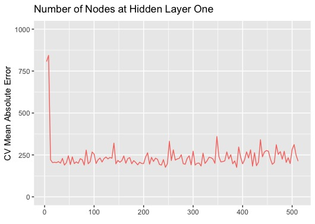

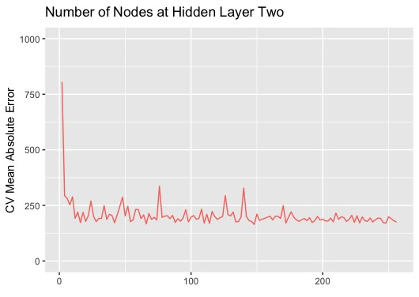

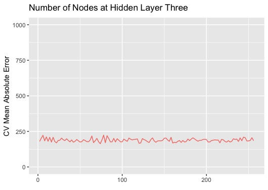

In order to decide the number of nodes in a hidden layer, cross-validation with 5 folds are applied layer by layer. Early stopping is used as well. For the first hidden layer, I take an experiment from 4 to 512 nodes by 4. For the second and third hidden layers, I take an experiment from 2 to 256 nodes by 2 since I don't think the large number of nodes are necessary. I try to select small capacity at each hidden layer to prevent overfitting. That is, the elbow point of Figure 1 is the choice for the number of nodes.
        
As DL get deeper, cross-validation mean absolute error becomes better and more stables. For example, the third hidden layer with 2 nodes has the almost same cross-validation mean absolute error as with 256 nodes. However, when I try the forth hidden layer, it becomes worse. The cross-validation mean absolute error of the fourth hidden layer tends to be higher than that of the second hidden layer. So, the fourth hidden layer is taken out.
        

### Batch size - 8 
    
Given the condition of early stopping, 10 batch sizes(1, 2, 4, 8, 16, 32, 64, 128, 256, and 512) are compared in terms of cross-validation mean absolute error. Under the same layers in (a), there is no huge difference between batch sizes. However, the batch size $= 8$ is the best and selected as the optimal batch size. 
    
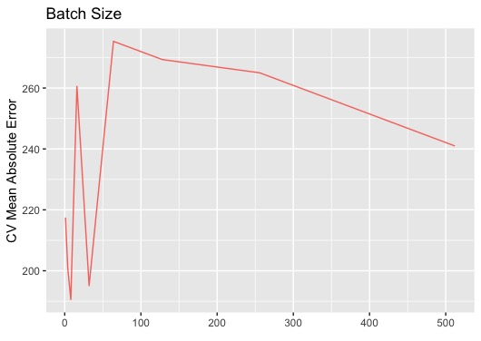
    
### Number of epochs - 130
    
Without early stopping, 0 to 500 epochs are evaluated by 5-fold cross-validation. Around 125 seems to be the optimal number of epochs. I evaluate from 100 to 150 in a detailed manner. Then, 130 is the optimal number of epochs to feed.
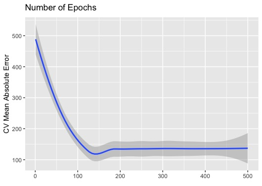

### Performance Comparison

LASSO performs the best, and Ridge the worst. 
|   | DL  | LASSO  | Ridge  | Elastic Net  |
|:-:|:-:|:-:|:-:|:-:|
| Train MAE | 110.6  | 111.7  | 119.2  | 112.2  |   |
| Test MAE  | 260.9  | 215.8  | 279.9  | 217.9  |

|   | DL  | LASSO  | Ridge  | Elastic Net  |
|:-:|:-:|:-:|:-:|:-:|
| Residual | 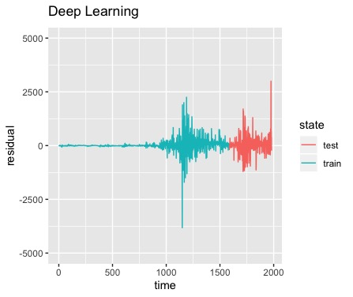  | 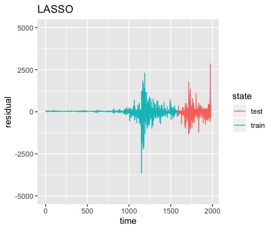  | 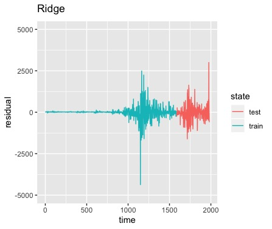  | 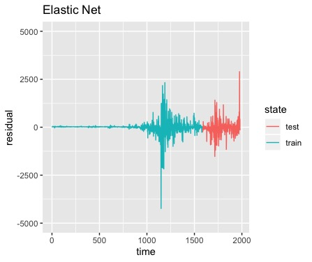  |
| Time Series  | 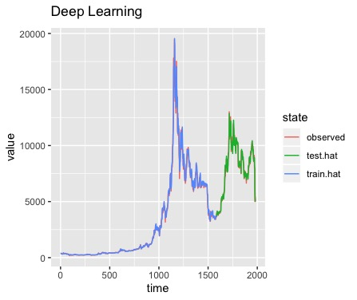 | 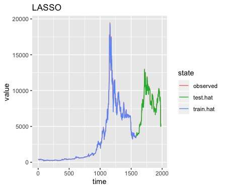 | 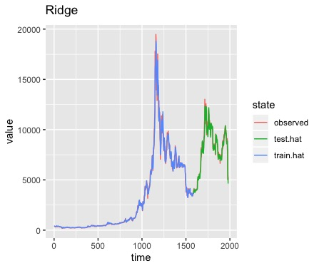 | 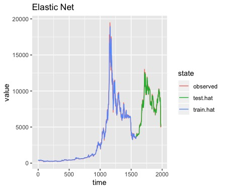 |

## Conclusion

For predicting the daily open price of bitcoin, LASSO regression is the best in terms of mean absolute error(215.8 dollars). However, all the models are quite good to predict the price of bitcoin because the bitcoin price is over 7,000 dollar and the mean absolute error is around 244 dollars at average.

DL the most spends time to optimize since that has much more hyperparameters than other models. The next step would be to apply L2 regularization because LASSO fits better this Bitcoin dataset.
